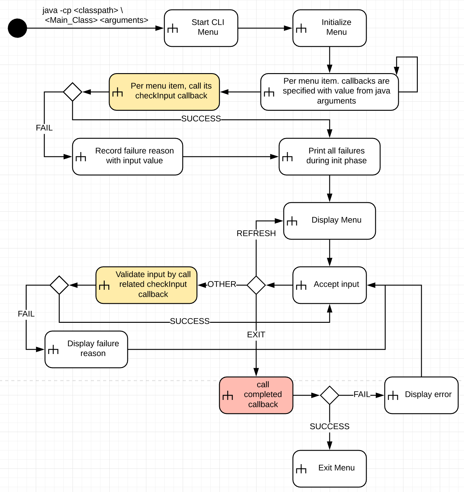

# java-cli-menu
An interactive menu for Java CLI.

Idealy, a Java command app can be trigger by ```java -cp <class> <params>```. But sometimes, a menu based configuration is useful and convinient. The interaction looks like:

```shell 1) --grammar,-g Grammar [Csv]           specify grammar name            It should be same with file name of your .g4   2) --startRule,-r  [token]           start rule name. &quot;token&quot; is a special value.   --  R): refresh menu;  X): exit   Your input [# value]: 1 some wrong values   &gt;! Bad
 Wrong arguments:
   --grammar: [it's an invalid value]
       Only 'Csv' is acceptable!

 1) --grammar,-g Grammar []
          specify grammar name

          It should be same with file name of your .g4

 2) --startRule,-r  []
          start rule name. "token" is a special value.

 --
 R): refresh menu;  X): exit


Your input [# value]: 1 Http
  >! Only 'Csv' is acceptable!

Your input [# value]: 1 Csv
Your input [# value]: 2 token
Your input [# value]: R

 1) --grammar,-g Grammar [Csv]
          specify grammar name

          It should be same with file name of your .g4

 2) --startRule,-r  [token]
          start rule name. "token" is a special value.

 --
 R): refresh menu;  X): exit


Your input [# value]: x

Back to main, let's continue.
```

Just try to run [CliMenuSample.java](https://github.com/zhhe-me/java-cli-menu/blob/master/src/test/java/me/zhhe/cli/menu/CliMenuSample.java) with input above.

This project is on the way and changes will happen any time without notification until it gets GA.

**Here is flow Java CLI Menu likes to support:**


